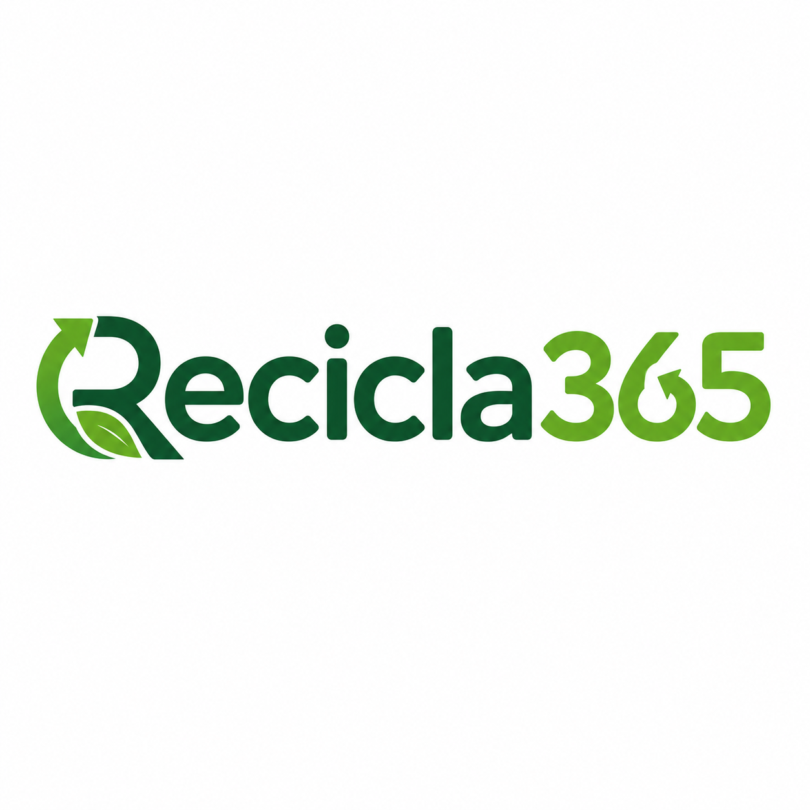
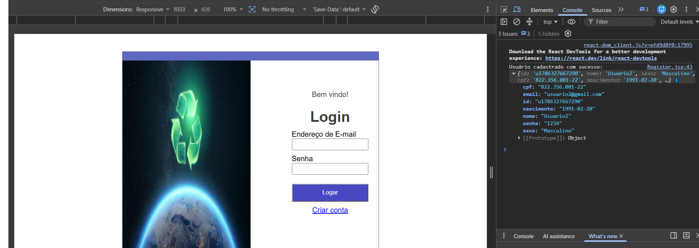
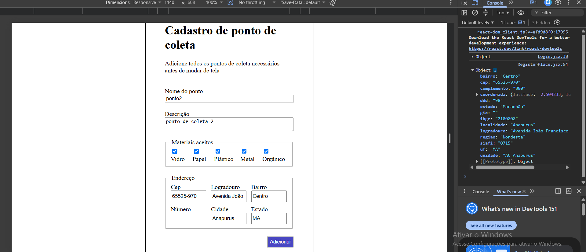
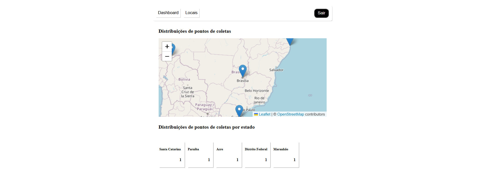
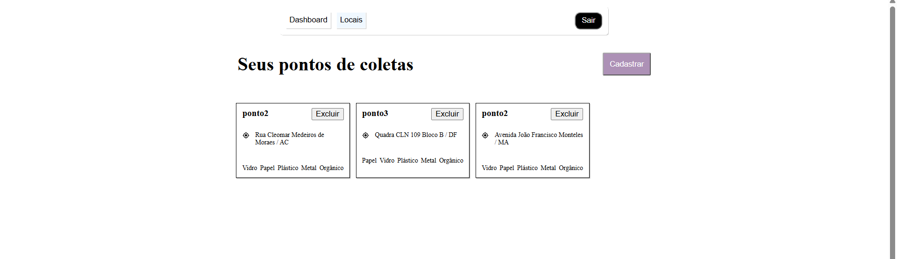
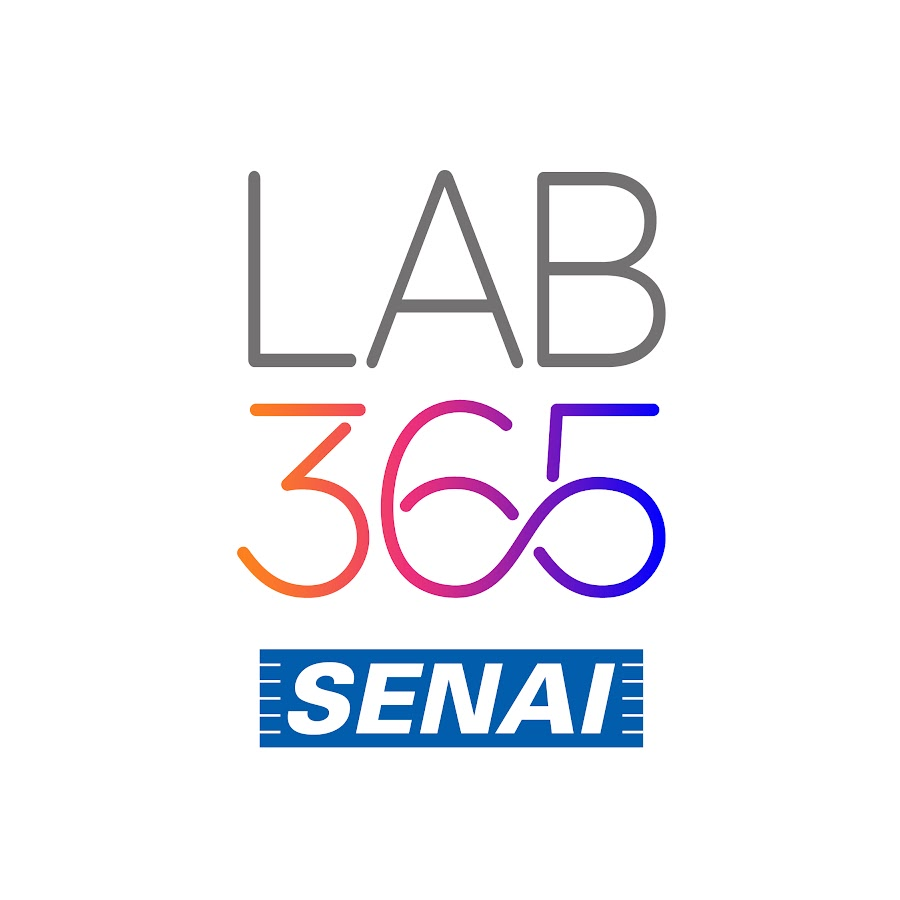

  

## Sobre

O Recicla365 é um projeto desenvolvido para fins educacionais, com o objetivo de desenvolver páginas web aplicando conceitos de Atomic Design utilizando HTML, CSS, JavaScript e React.

A aplicação permite o mapeamento de pontos de coleta pelo país podendo cadastrar usuários e gerenciar os pontos de coleta.

Por se tratar de um projeto desenvolvido para fins de estudo, novas funcionalidades, melhorias de segurança, validações e aprimoramentos de arquitetura podem ser incorporados futuramente.

## Configurações

### Ferramentas

- VS Code: https://code.visualstudio.com
- Node.js: https://nodejs.org/pt-br

### Execução

#### Back-end

- Clone o repositório: `git clone https://github.com/israelvieiradev/api-coletas.git`
- Instale o gerenciador de pacotes: `npm install`
- Inicialize a API: `npm start`

#### Front-end

- Clone o repositório: `git clone https://github.com/israelvieiradev/recicla365.git`
- Instale o gerenciador de pacotes: `npm install`
- Inicialize a API: `npm run dev`

## Uso

*Todos os dados necessários estarão disponíveis no console do navegador*

- Após o cadastro o usuário é redirecionado para tela de login

- Você pode registrar pontos de coleta existentes pelo país para o gerenciamento

- Dashboard mostra os pontos cadastrados no mapa

- Locais mostra mais detalhes sobre cada ponto de coleta

## Contribuidores

|                                                     |
|-----------------------------------------------------|
| 
| [LAB365](https://github.com/lab365-operacao)        |
